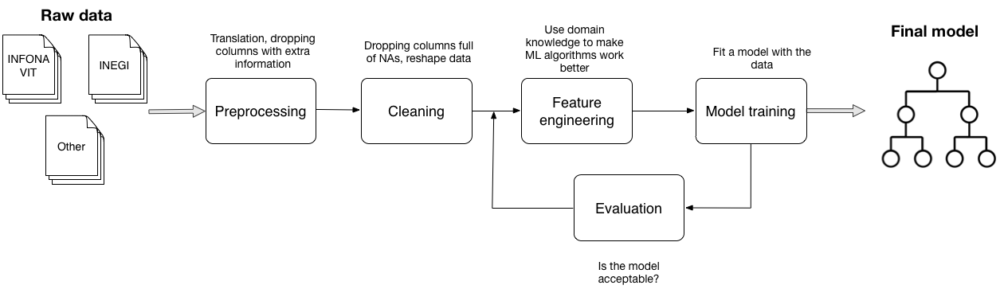
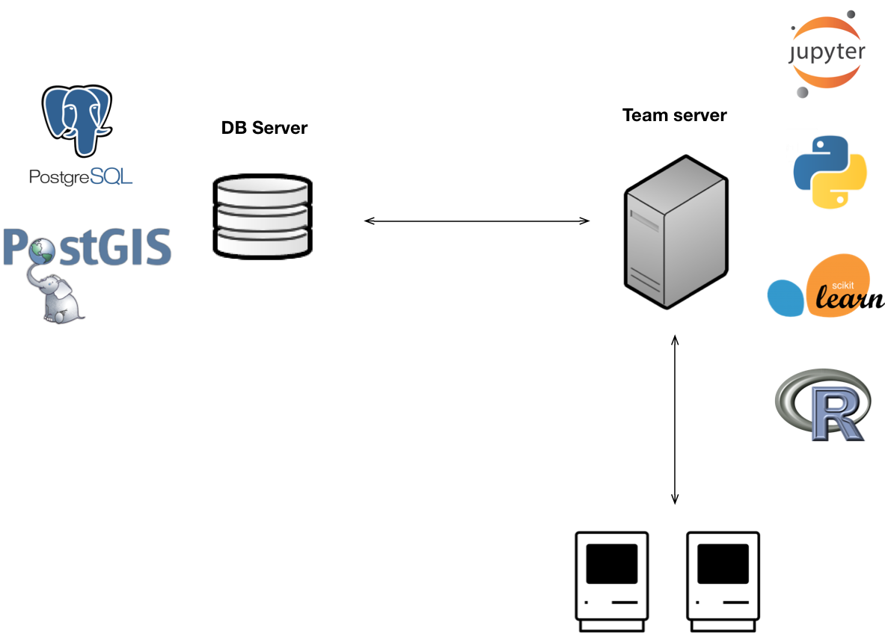

# Reducing home abandonment in Mexico (DSSG 2015)

Home abandonment is a major cause of negative financial and economic outcomes both for individuals and lending institutions in Mexico. **To date, home abandonment has affected more than 200,000 homes financed by Infonavit** (the largest mortgage provider in Mexico). Such institution was created by the government for the purpose of assisting lower-income families that cannot obtain financing from a private institution (such as banks). To advance its mission the organization wants to understand the relationship between policy, social influences, and dwelling abandonment. 

During the summer, the team created **a model to predict the probability of home abandonment and measure the impact of different factors at various levels of granularity.** These results will help Infonavit give better advice to Mexican workers when they apply for a loan, improve the location of new housing developments, and give decision-based recommendations to the federal government to influence public policy and improve economic outcomes for the citizens of Mexico.

For more information, refer to the following sources:

* [Improving Long-Term Financial Soundness by Identifying Causes of Home Abandonment in Mexico (DSSG Blog)](http://dssg.uchicago.edu/2000/03/02/org-infonavit.html)
* [Infonavit Project: Reducing Home Abandonment](http://dssg.io/2015/08/13/infonavit-abandonment.html)

## Tools

* Database
    * PostgreSQL
* Programming languages
    * Python
    * R
* Frameworks/Libraries
    * [scikit-learn](http://scikit-learn.org/stable/)
    * [Jupyter](https://jupyter.org/)
    * [Pandas](http://pandas.pydata.org/)
    
## How to use this repository

### Folder structure

* **Cleaning**. Cleaning scripts for the features table.
* **db_scripts**. Contains the scripts used for table creating,  data uploading, among others.
* **Diagrams**. Includes diagrams used for this README as well as some other used throughout the project.
* **Feature-engineering**. Scripts used for producing the municipality features.
* **Geo_scripts**. Scripts for geospatial feature generation.
* **Mockups**. Includes mockups for the prototype.
* **Model**. Scripts and notebooks used for modeling.
* **Pipeline_src**. Source code for the project's pipeline.
* **Preprocessing**. Scripts for preprocessing municipality features.
* **Useful_scripts**. R scripts used for computing municipality features.
* **Webapp**. Source code for the prototype.

### Running the prototype

Our final prototype is a web that predicts home abandonment based on personal, loan and location characteristics. The prototype was built using the following tools:

* [Flask](http://flask.pocoo.org/)
* [Bootstrap](http://getbootstrap.com/)
* [CartoDB](https://cartodb.com/)
* [jQuery](https://jquery.com/)

To run the model locally, follow these instructions:

`git clone https://github.com/dssg/infonavit.git`

`cd infonavit/webapp`

`pip install -r requirements.txt`

`python home.py`

The webapp will start running by default on `http://127.0.0.1:5000/`

## Data
<html>
<table>
    <th>Name</th>
    <th>Source</th>
    <th>Preprocessing</th>
    <th>Cleaning</th>
    <th>Comments</th>
    

    <tr>
        <td>Homicides</td>
        <td>Diego Valle-Jones Blog (INEGI)*</td>
        <td>Yes. Adds CVE** column</td>
        <td>No.</td>
        <td>Columns normalized over 1000 inhabitants.</td>
    </tr>

    <tr>
        <td>Municipalities and states</td>
        <td>INEGI</td>
        <td>Yes. Rename columns.</td>
        <td>No.</td>
        <td></td>
    </tr>

    <tr>
        <td>Population</td>
        <td>INEGI</td>
        <td>Yes. Column and variable translation, drops useless columns, merges data from 4 datasets.</td>
        <td>Yes. Drops rows full of NAs</td>
        <td>Population census is done every five years.</td>
    </tr>

    
    <tr>
        <td>Vehicles</td>
        <td>INEGI</td>
        <td>Yes. Column dropping and renaming. Add CVE column.</td>
        <td>No.</td>
        <td></td>
    </tr>
    
    <tr>
        <td>Economic activity (DENUE)</td>
        <td>INEGI</td>
        <td></td>
        <td></td>
        <td>This is our most important dataset, all location features are computed using this data.</td>
    </tr>
    
    <tr>
        <td>Natural disasters</td>
        <td>Desinventar.org</td>
        <td>Yes, convert db file to csv. Column dropping, CVE column creation.</td>
        <td></td>
        <td></td>
    </tr>
    
        <tr>
        <td>Natality, mortality</td>
        <td>INEGI</td>
        <td>Yes. Data reshaping.</td>
        <td></td>
        <td></td>
    </tr>

</table>
</html>
**Note**: INFONAVIT data details omitted for privacy reasons.  
\*Diego Valle-Jones provides a clean version of INEGI data  
\**CVE is an identifier for each municipality in Mexico.

## Data pipeline

</img>

## Data enviroment

</img>

*Computer By Olivier Guin, FR*

## The team

</img>
